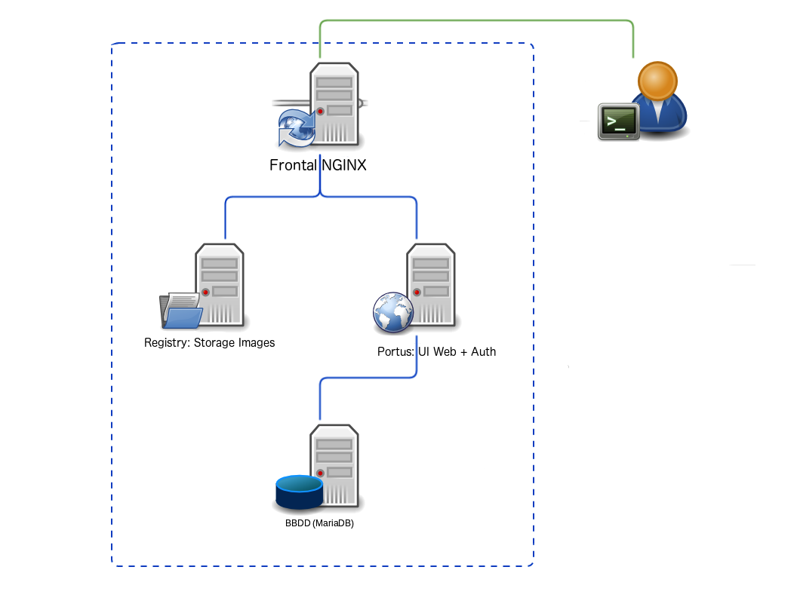

# Portus & Registry

### Web interface for Docker registry

Portus provides quick access to all the images available on your private
instance of Docker registry. User's privileges are taken into account to
make sure private images (the ones requiring special rights also for
`docker pull`) are not shown to unauthorized personnel.

## Deploying
1. Clone

        git clone git@github.com:liskior/portus.git

2. Run

        docker-compose up -d

## LDAP

To test you can use login "riemann" and password "password".

If enabled, then only users of the specified LDAP server will be able to use Portus.

    portus/config-local.yml

    ldap:
        enabled: false
        hostname: "ldap_hostname"
        port: 389
        method: "plain"
        base: ""
        filter: ""
        uid: "uid"

    authentication:
    enabled: false
    bind_dn: ""
    password: ""

    guess_email:
    enabled: false
    attr: ""

Some notes:

base: The base where users are located (e.g. “ou=users,dc=example,dc=com”).

filter: This option comes in handy when you want to filter even further the results that might be hanging from the base.

method: The method of encryption between Portus and the LDAP server. It defaults to “plain”, which means that the communication won’t be encrypted. You can also use “simple_tls”, to setup LDAP over SSL/TLS. However, the recommended value is “starttls”, which sets StartTLS as the encryption method.

guess_email: Portus needs an email for each user, but there’s no standard way to get that from LDAP servers. You can tell Portus how to get the email from users registered in the LDAP server with this configurable value.

uid: The attribute where Portus will look for the user ID when authenticating.

authentication: Some LDAP servers require a binding user in order to authenticate. You can specify this user by enabling this option. Then you should provide the DN of this user in the bind_dn value.

There are three possibilities for the guess_email option:

disabled: this is the default value. It means that Portus won’t do a thing when registering LDAP users (users will be redirected to their profile page until they setup an email account).

enabled where “attr” is empty: for this you need “ldap.base” to have some value. In this case, the hostname will be guessed from the domain component of the provided base string. For example, for the dn: “ou=users,dc=example,dc=com”, and a user named “mssola”, the resulting email is “mssola@example.com”.

enabled where “attr” is not empty: with this you specify the attribute inside a LDIF record where the email is set.
If something goes wrong when trying to guess the email, then it just falls back to the default behavior (empty email).

## Overview

In this video you can get an overview of some of the features and capabilities
of Portus.

Info and video is from [Portus site](http://port.us.org/documentation.html).
